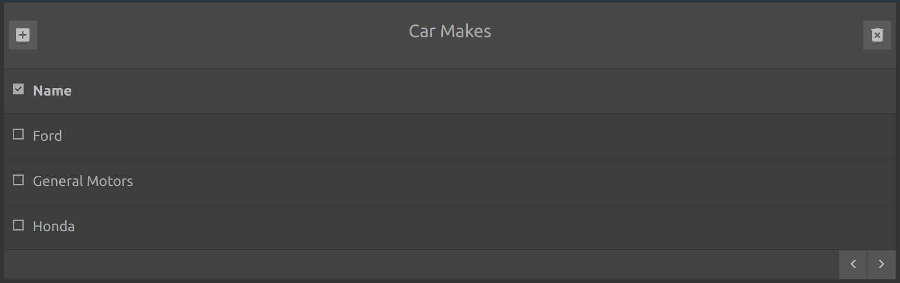

## Cars - Makes and Models

You can try out the entire app here:

[https://cars.jeffclemmer.net/](https://cars.jeffclemmer.net/)

This _was_ a quick React Demo App I threw together over a couple of days. Now it's got a full backend using AWS API Gateway -> Lambda -> DynamoDB and configured using AWS SAM / CloudFormation.

This app could be classified as a Single Page App or SPA.

It implements a simple car inventory system. There is one feature that isn't implemented. Editing. That's easily added though. Let me know if you'd like me to do that.

I built this to keep up with modern AWS and React development.

## Cloud Providers

This app uses multiple cloud providers to do its thing.

AWS hosts the back end API and DB.

The front end is hosted on Cloudflare Pages.

[https://pages.cloudflare.com/](https://pages.cloudflare.com/)

## Components

I'm particularly proud of src/components/List.js and ListItem.js

These are variable column Table List components using CSS Grid with an array that adjusts the positioning of the columns quickly. You can feed ListItem with any data and feed it an array of items you'd like it to display and it will pull each field out of the item passed and display it in the order that you prefer.
